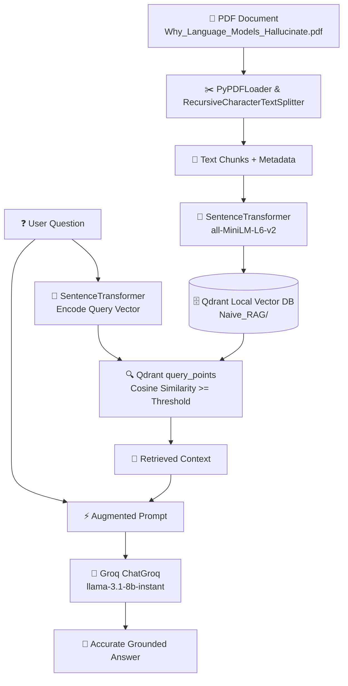

# 🧠 Naive RAG with Qdrant & Groq LLaMA 3.1

A lightweight, end-to-end **Retrieval-Augmented Generation (RAG)** pipeline built using **Qdrant** (local disk vector store), **Sentence-Transformers** (`all-MiniLM-L6-v2`), **LangChain**, and **Groq LLaMA 3.1**.

---

## 📌 Architecture & Workflow



---

## ✨ Features

- **Local Vector Storage**: Utilizes Qdrant's embedded local on-disk storage (`./Naive_RAG`) without requiring a separate Docker container or cloud cluster.
- **Dense Semantic Embeddings**: Generates 384-dimensional dense vectors using `sentence-transformers/all-MiniLM-L6-v2`.
- **Accurate Similarity Retrieval**: Employs Cosine Distance with score thresholding and top-$k$ filtering to retrieve the most relevant context chunks.
- **Ultra-Fast LLM Inference**: Leverages Groq's high-speed LPU infrastructure running `llama-3.1-8b-instant` via `langchain-groq`.
- **Interactive Jupyter Notebook**: Well-documented steps in [Qdrant.ipynb](file:///Users/debajyotihazra/Documents/QDrant%20Use/Qdrant.ipynb) for easy experimentation.

---

## 📂 Project Structure

```text
.
├── Naive_RAG/                                  # Local Qdrant vector database storage
│   ├── collection/
│   └── meta.json
├── Qdrant.ipynb                                # Main RAG pipeline notebook
├── Why_Language_Models_Hallucinate_Explainer.pdf # Sample input document
├── Requirements.txt                            # Python dependencies
├── Readme.md                                   # Project documentation
├── .env                                        # Environment variables (Groq API Key)
└── .gitignore
```

---

## 🚀 Getting Started

### 1. Clone & Setup Environment

Create and activate a Python virtual environment:

```bash
# Create virtual environment
python3 -m venv .venv

# Activate on macOS/Linux:
source .venv/bin/activate

# Activate on Windows:
# .venv\Scripts\activate
```

### 2. Install Dependencies

Install the required packages from [Requirements.txt](file:///Users/debajyotihazra/Documents/QDrant%20Use/Requirements.txt):

```bash
pip install -r Requirements.txt
```

*(Optional: Ensure `qdrant-client` and `python-dotenv` are installed if working outside pre-configured environments)*:
```bash
pip install qdrant-client python-dotenv
```

### 3. Configure Environment Variables

Create a `.env` file in the root directory:

```env
GROQ_API_KEY=your_groq_api_key_here
```

Get your free API key from [Groq Console](https://console.groq.com/).

---

## 📖 Pipeline Walkthrough

Open and run [Qdrant.ipynb](file:///Users/debajyotihazra/Documents/QDrant%20Use/Qdrant.ipynb) step-by-step:

### Step 1: Load and Split PDF
```python
from langchain_community.document_loaders import PyPDFLoader
from langchain_text_splitters import RecursiveCharacterTextSplitter

loader = PyPDFLoader('Why_Language_Models_Hallucinate_Explainer.pdf')
pages = loader.load()

text_splitter = RecursiveCharacterTextSplitter(chunk_size=1200, chunk_overlap=150)
texts = text_splitter.split_documents(pages)
chunks = [i.page_content for i in texts]
metadata = [i.metadata for i in texts]
```

### Step 2: Compute Embeddings
```python
from sentence_transformers import SentenceTransformer

embed_transformer = SentenceTransformer(model_name_or_path='all-MiniLM-L6-v2', similarity_fn_name='cosine')
embeddings = embed_transformer.encode(chunks)
```

### Step 3: Initialize Qdrant & Create Collection
```python
from qdrant_client import QdrantClient
from qdrant_client.models import VectorParams, Distance, PointStruct

collection_name = 'Model_Halucination'

client = QdrantClient(path='./Naive_RAG')

if not client.collection_exists(collection_name=collection_name):
    client.create_collection(
        collection_name=collection_name,
        vectors_config=VectorParams(size=384, distance=Distance.COSINE)
    )
```

### Step 4: Upsert Vector Points
```python
points = []
for i, (chunk, meta) in enumerate(zip(chunks, metadata)):
    vector = embed_transformer.encode(chunk).tolist()
    payload = dict(meta)
    payload['text'] = chunk
    points.append(PointStruct(id=i, vector=vector, payload=payload))

client.upsert(collection_name=collection_name, points=points)
```

### Step 5: Query Retrieval & Answer Generation
```python
import os
from dotenv import load_dotenv
from langchain_groq import ChatGroq

load_dotenv()

def retrieve_chunks(query: str, threshold: float = 0.3, k_top: int = 3):
    query_encode = embed_transformer.encode(query).tolist()
    result = client.query_points(collection_name=collection_name, query=query_encode, limit=k_top).points
    near_chunks = [r.payload['text'] for r in result if r.score is None or r.score >= threshold]
    return '\n\n'.join(near_chunks) if near_chunks else 'Not Relevant Content'

query = 'why we need to learn LLM ?'
content = retrieve_chunks(query=query)

prompt = f"""
Provide answers to the user questions based on the provided data:
Content: {content}
Question: {query}
"""

groq = ChatGroq(model='llama-3.1-8b-instant', api_key=os.getenv('GROQ_API_KEY'))
response = groq.invoke(prompt).content
print(response)
```

---

## 🛠️ Configuration & Customization

| Parameter | Default | Description |
| :--- | :--- | :--- |
| `chunk_size` | `1200` | Target token/character length per document chunk |
| `chunk_overlap` | `150` | Overlap between consecutive chunks to preserve context |
| `Embedding Model` | `all-MiniLM-L6-v2` | SentenceTransformer model (384 dimensions) |
| `Distance Metric` | `Cosine` | Vector similarity metric for Qdrant |
| `Similarity Threshold` | `0.3` | Minimum similarity score required for context inclusion |
| `LLM Model` | `llama-3.1-8b-instant` | Groq LPU model for fast text generation |
| `Qdrant Storage` | `./Naive_RAG` | Local directory for persistent vector index |

---

## 💡 Switching to Qdrant Cloud or Docker

To scale beyond embedded local disk storage:

```python
# Connect to Qdrant Docker (http://localhost:6333)
client = QdrantClient(url="http://localhost:6333")

# Or connect to Qdrant Cloud Cluster
client = QdrantClient(
    url="https://your-cluster-id.us-east-1-0.aws.cloud.qdrant.io:6333",
    api_key=os.getenv("QDRANT_API_KEY")
)
```

---

## 📄 License

This project is open-source and available under the [MIT License](LICENSE).
